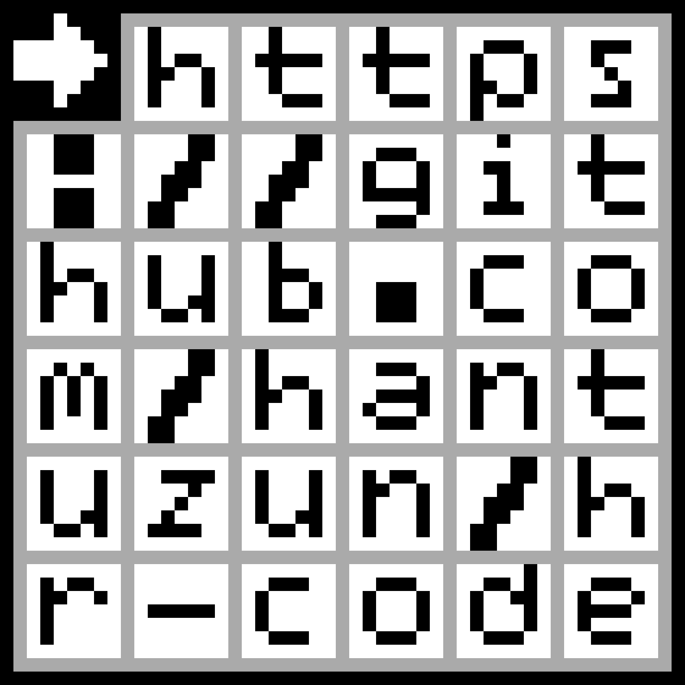
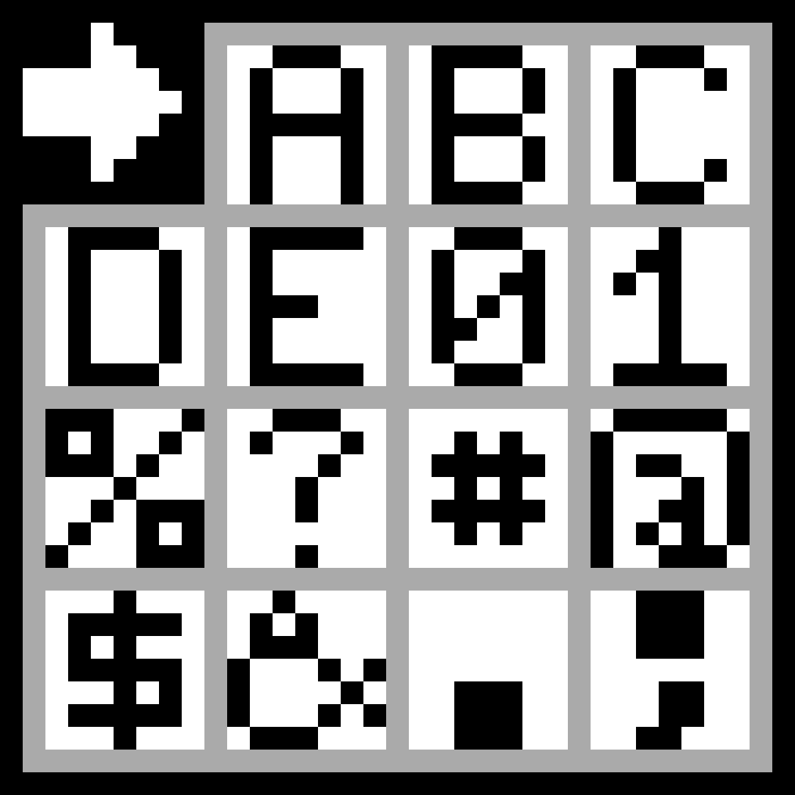

  
# HR code
**Human Response Code**: Designed to be recognized by humans and OCR. Encodes all valid URL characters to images.

## Motivation

QR codes has pros and cons as with everything else. While scanning a QR code is way convenient that typing a string on a phone, the fact that QR codes are not human readable has caused and will continue to cause security issues.

Rather than hoping that QR scanners are safe from malicious QR codes and they are taking their users consent before opening a webpage, let's create a human readable QR code alternative: HR code.

The most prevalent use case of QR codes is encoding URLs into images. For this purpose, HR code has the following advantages and disadvantages over QR code:

### Advantages
 * Users could have an understanding of the data before taking the pain to scan it.
 * More resistant to phishing attacks as the users could see the URL in print as well.
 * Harder to interfere by painting black squares on a printed code and directing users to a similar, but malicious URL.
 * Free to use in any way without attribution. Not protected by a trademark or license like QR code: https://www.qrcode.com/en/faq.html#patentH2Title
 * Better looking than printer glitches.

### Disadvantages
 * Unlikely to be adopted by default camera applications even decades later due to network effects.
 * Larger size required for the same information and scanner quality.

## Specification

### Overview

 * HR Codes are rectangle images.
 * HR Codes are surrounded by a border.
 * HR code is read from left to right and from top to bottom, just as English.
 * There must be an rightwards arrow on the top left.
 * Each character occupies the same square size.
 * Characters are separated by a constant size padding, which creates an uniform grid.

### Characters

 * All valid characters for URLs are also valid HR code characters.
 * The complete list of characters is: `A-Z`, `a-z`, `0-9`, `-`, `.`, `_`, `~`, `:`, `/`, `?`, `#`, `[`, `]`, `@`, `!`, `$`, `&`, `'`, `(`, `)`, `*`, `+`, `,`, `;`, `%`, and `=`.
 * Updates in [RFC 3986 (Uniform Resource Identifier (URI): Generic Syntax)](https://www.ietf.org/rfc/rfc3986.txt) could require HR code to support additional characters.

### Colors

 * Black for character strokes, the borders, the initial arrow background, and the padding between the initial arrow and the borders.
 * White for character backgrounds and the initial arrow stroke.
 * Light gray (`#aaa`) for the padding between character backgrounds, which creates a gray grid.
 * Trailing empty character spaces, if any, are filled with light gray, not white.

### Layout

 * A text of `n` characters should be placed into a square HR code with the following number of rows and columns: `√(n+1)` rounded up to the smallest integer.
   * For example, 100 characters should be placed into a square of 11x11 characters. since `10 < √101 <= 11`.
 * Borders and grid paddings are 1 unit.
 * Character backgrounds are 7 x 7 units.
 * If `a` is the number of rows, and `b` is the number of columns, the rendered image is `8a+3`
   units tall and `8b+3` units wide, considering the borders and paddings.


## Examples

### Some characters

The following characters generate the HR code below them:

```
➡️ABC
DE01
%?#@
$&.;
```



This image is 35 units tall and wide.

---

### This url `https://github.com/hantuzun/hr-code`

The HR code above is the rendering of this url in the format below:

```
➡️https
://git
hub.co
m/hant
uzun/h
r-code
```


This image is 51 units tall and wide.

## License

<p xmlns:dct="http://purl.org/dc/terms/">
  <a rel="license"
     href="http://creativecommons.org/publicdomain/zero/1.0/">
    
  </a>
  <br />
  To the extent possible under law,
  <a rel="dct:publisher"
     href="hantuzun.com">
    <span property="dct:title">Han Tuzun</span></a>
  has waived all copyright and related or neighboring rights to
  <span property="dct:title">HR code</span>.
</p>
